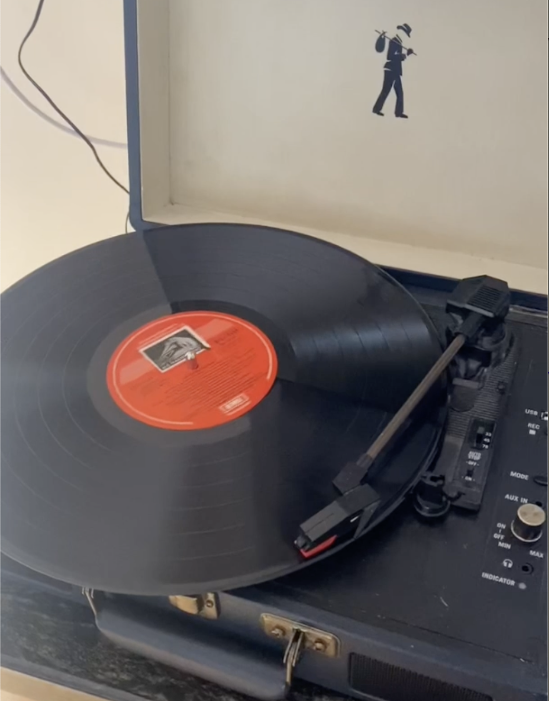

# TurnTable  
**Reviving a Retro Turntable**

### Preamble  

I was asked if I could fix the turntable shown above, which refused to power on or play any records. At first, I thought it would be a reasonably simple fix since the unit wasn’t powering up at all. Upon opening it, however, I found that the electronics inside were fairly modern, with a PCB densely populated with SMD components.

### Probing the PCB

Initial probing showed that despite the lack of motion or LED activity, the unit was receiving a 5V DC supply from the power plug, and some ICs had their VCC at 5V. I initially suspected the motor might be faulty and began checking it. The motor’s label indicated it could run on 5V to 12V DC. Its winding resistance seemed normal—no shorts or open conditions—but the motor wasn’t receiving any voltage. Clearly, the issue was deeper than I had anticipated.

### 🚀 Boost Converter — The Culprit?

I noticed that if the cue arm was positioned at either extreme of the platter, the motor would cut out. Suspecting a broken link or mechanical switch, I dismantled the assembly and traced all wiring from the cue arm back to the PCB. Eventually, I checked the motor’s power switching circuit and found nothing obviously wrong.

It took me a while to identify the various ICs, despite some helpful clues from ChatGPT about how audio systems like this are typically configured. Part of the confusion stemmed from ambiguous chip markings—sometimes the relevant identifier was on the second line, other times the first.

Eventually, I identified a tiny boost converter chip—**MC34063A**—being used to step up the voltage (likely to 12V) for the motor. Initial measurements showed that the motor was receiving only ~0.5V. Although I had some understanding of buck-boost converters, the specific configuration of this IC was unfamiliar. Again, ChatGPT helped guide me through how this device was expected to function.

A lot of time went into tracing the circuit related to this boost converter. It became clear that the main microprocessor (a proprietary KP-3128) was responsible for providing the pulsed excitation needed for the boost converter to operate. The IC's internal oscillator was functioning at the expected frequency, and it was supplying 3.3V to other chips on the board.

So I refocused on the boost converter. Voltage measurements on the converter's pins revealed that it wasn’t receiving VCC (5V) on pin 6. Despite checking for broken tracks, everything looked intact. This led me to suspect an internal failure of the chip itself. I decided to replace the chip and see if that resolved the issue...

### The Real Culprit Revealed

The signal to pin 6 of the boost converter chip was actually being controlled by another IC (labeled "XYKey"), which switches VCC via transistors Q9 and Q7. I regretted replacing the chip prematurely—especially since this subtlety was not picked up even by ChatGPT! The schematic later made this interaction clear:  
[📄 View Schematic](./turntable.pdf)

### Tedious Boost Converter Chip Replacement

ChatGPT had reassured me that 5V should be present at pin 6. So I forced that pin high to test the chip—at least it would help narrow down the issue. It took me a week to source the replacement. Meanwhile, I attempted to remove the original IC. This was my first attempt at working with SMD components. Without a proper hot-air soldering station, the job was anything but pleasant.

I ended up destroying the IC, but thankfully the solder pads remained intact. I decided to use thin ribbon cables to replace the SMD chip with a through-hole version (which I could obtain locally). This truly tested my patience and skill—soldering fine wires onto tiny pads using a slightly-too-large soldering iron. Eventually, I made it work. I even used hot glue to provide stress relief—though I won’t show that photo, as it’s not the prettiest job.

### It Begins to Spin

I was confident the board would work once the new socket-mounted IC was soldered externally. But alas—still no VCC at pin 6. My heart sank. I’d made the classic mistake: removing a good component thinking it was faulty. This isn’t the first time I’ve done that. Do the pros make this mistake too?

Nevertheless, a valuable lesson. I wasn’t quite defeated. I soldered a wire from the 5V line directly to pin 6 of the chip—and lo and behold, the platter began to spin! I measured 9.7V at the motor terminals. I then checked the platter speed at all three settings: 33 and 45 RPM were spot on, although the fastest setting (72 RPM) couldn't quite be reached. But that was a minor issue—I was satisfied.

### A Faint Hope

Excited, I placed the sample record provided and tried listening. I could hear a whisper of a tune! The volume control, however, had no effect. So what now?

Time to analyze the rest of the circuit.

The system consists of several blocks:

- 🟢 **Boost Converter**: Generates a higher voltage to drive the DC motor  
- 🟢 **Pre-Amplifier**: Amplifies the stylus signal to ~100–200 mV  
- 🟢 **Final Amplifier**: Further amplifies to speaker-driving levels  
- 🟢 **Microcontroller**: Controls power, modes (playback/record), ADC for USB audio, etc.  
- 🟢 **MUX**: Selects between audio sources  
- 🟢 **XYKey**: Likely a digital IO buffer/latch under microcontroller control  

### The Penny Drops

After tracing most of the signal paths, I found that the final amplifier (IC 4863) wasn't receiving the output from the preamp. Oscilloscope measurements confirmed that the stylus signal, not the amplified one, was reaching the amplifier. Despite several attempts, I couldn’t find a complete path from the MUX chip (which should have fed the amp) to the amp’s input pins.

Strangely, a weak signal seemed to be arriving at the amp “from nowhere.” ChatGPT suggested this might be due to capacitive coupling—an artifact, not a proper signal.

To test the final amplifier's health, I connected my laptop's headphone output to the amp input via the volume pot’s wiper. Sure enough, solid sound emerged from the speakers. So both the preamp and amplifier were working fine—it was just the signal routing that had gone wrong.

Checking the MUX select lines (pins 9 and 10), I discovered the microcontroller was selecting the AUX input instead of the preamp output. I tried pulling those lines high using resistors, but the microcontroller still seemed to override them. ChatGPT floated the idea that the MUX might be latched and stuck in the wrong state.

### Final Diagnosis and Bypass

Between:

- The VCC failure to the boost converter,
- MUX stuck on AUX input,
- LED indicators not responding,

... it became clear that something was off with the microcontroller and possibly the XYKey chip. Although the micro still supplied 3.3V to other chips, its behavior was inconsistent and erratic—possibly due to a brownout or partial failure.

With time running out, I decided to cut my losses. I bypassed all control circuitry and connected the preamp output directly to the final amplifier input. By this point, I had developed a solid understanding of audio signal levels needed for clean output.

This fix sacrificed features like USB recording/playback—but it brought the turntable back to life.

### 🎵 Music to My Ears

With this fix in place, I could finally enjoy old Bengali songs with clear, controllable sound. Since the microcontroller is proprietary, I doubt I could have done more without resorting to a full redesign.

In the end, the entire process was educational—though taxing on my eyes and neck! It also helped me keep my mind off a bad case of the flu I endured during this project. I hope my niece enjoys the turntable after all the effort that went into it.

### 🛠 Technical Summary

✅ Reverse-engineered signal paths from minimal information  
✅ Diagnosed and restored a faulty boost converter  
✅ Isolated the microcontroller’s failing influence  
✅ Verified audio chain integrity up to the final amplifier  
✅ Rewired the signal path for working volume control  

### Acknowledgements
Without useful feedback from ChatGPT at all stages of this project I would not have 
achieved this result. It also helped polish this write up.
