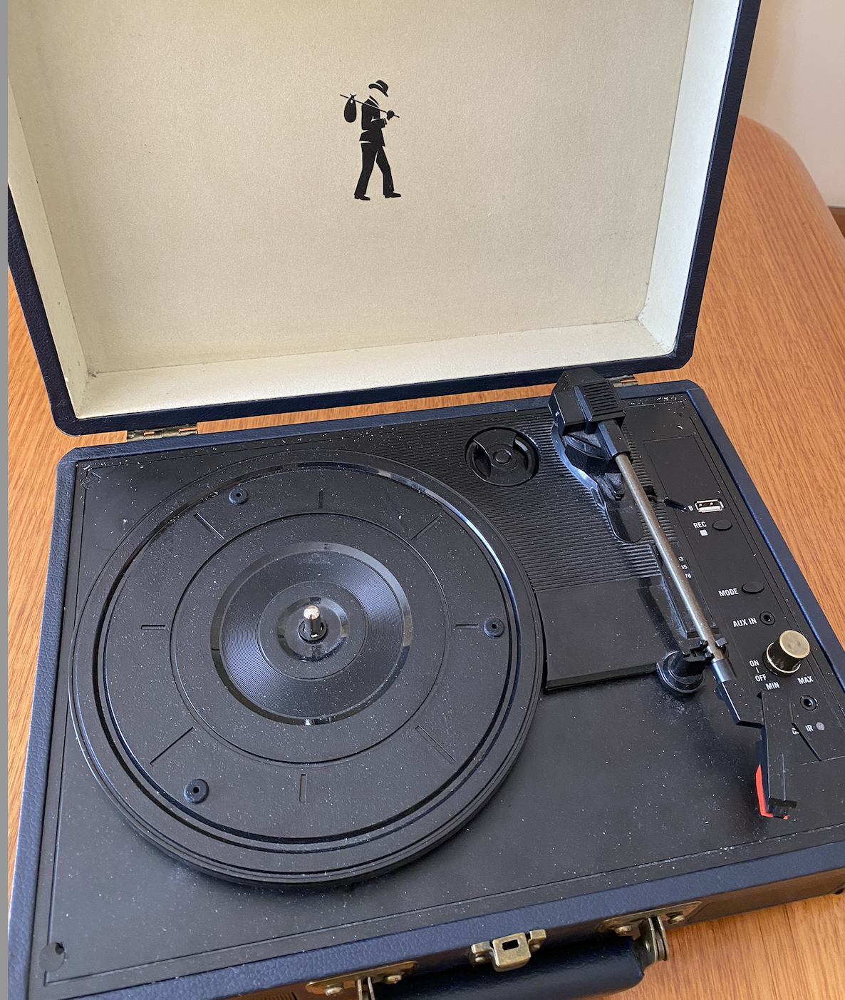
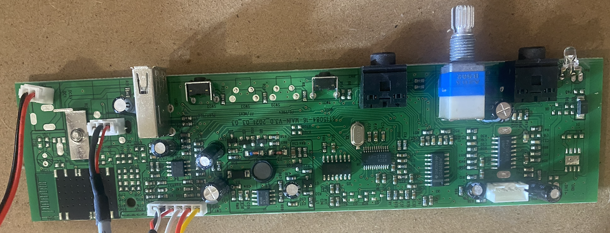
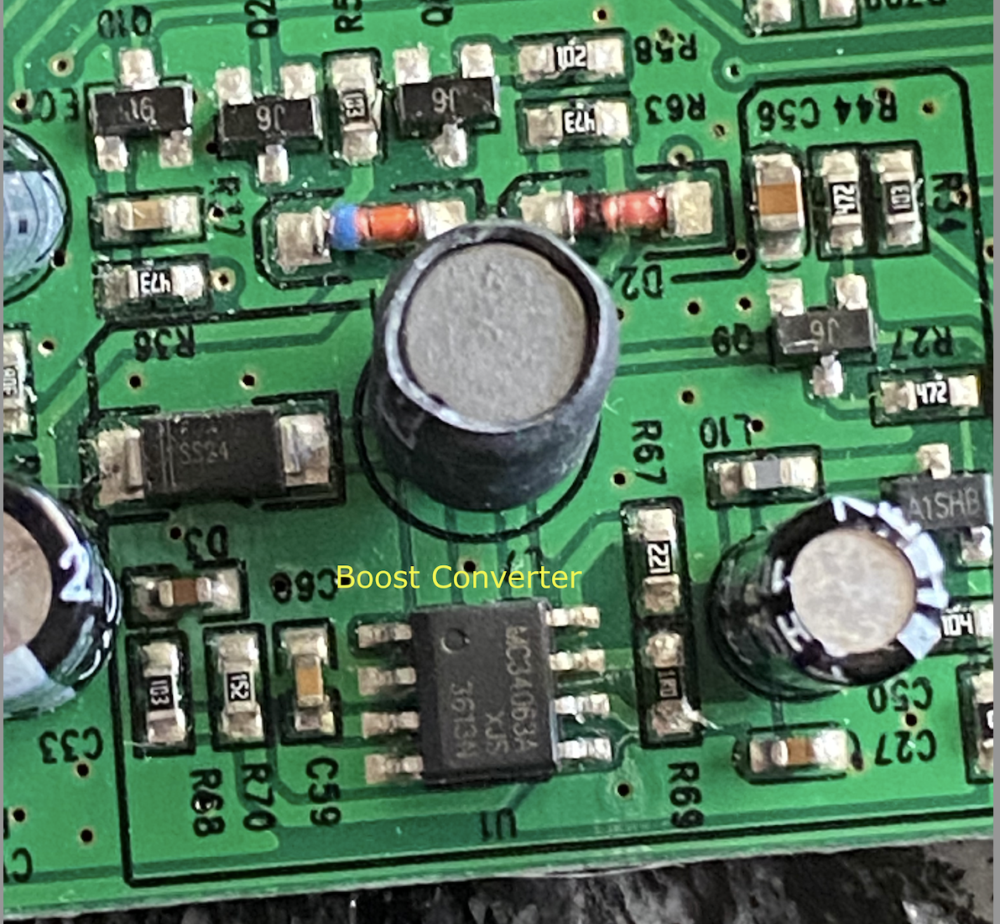
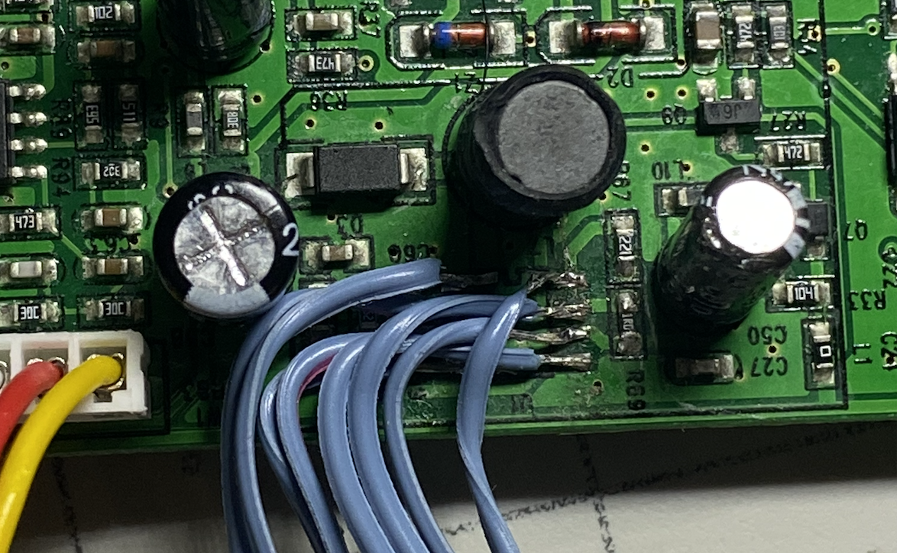

# TurnTable
Reviving Retro Turntable

### Preamble
</img>

I was asked if I could fix the above Turntable which refused to turn on and play 
any records. At the start I thought it should be reasonably simple fix given there
is no power to the unit. I first opened up the unit to find the electronics in it
is fairly modern with PCB that is significantly dense with SMD components.

</img>
</img>

### Probing the PCB

Initial probing showed, despite the lack of turntable motion or led light there is 
supply voltage (5VDC from the power plug) and some of the ICs do have their VCC at 5V.
So I suspected that the motor could be faulty and proceeded to check its integrity. The DC motor 
marking clearly showed that it can be driven for 5V to 12VDC.  Winding resistences appeared
normal with no shorts or open condition. But the motor was not getting no volts at all.
So the problem is deeper than I originally imagined. 

### Boost Converter the Culprit?
If the cue arm is at either extreams of the platen the motor would cut out. So suspecting
that there could be a broken link I dug deeper, dismantling the whole assembly and tracing all
wiring from the cue arm, to the PCB. Eventually I traced back the wires to see if the motor 
power switching is working as expected and couldn't find anything amiss. It took me a while to
figure out the various ICs despite 
some clues from CHATGPT about  how such audio systems are configured. Most of the problem was in looking
at the markings that are not relavant. Sometimes the second line of the marking is relavant while
other times the first one. Anyway homed in a tiny boost converter chip (MC34063A) on the board that was
being used to boost the voltage to higher voltage (probably to 12V?) to drive the motor. Initial
measurements showed that there is about 0.5V to the turntable motor. While I have some understanding 
of buck boost converters, the way this IC worked was not familiar to me. Once again CHATGPT led me 
by hand to teach me how this device is configured to run. 

</img>
A lot of time was spent tracing all the circuit related to this boost converter. It became clear
that the main microprocessor (KP-3128 ... a proprietery micro) is responsible for
pulsing excitation to enable boost converter to work. The oscillator of this IC was at the expected 
frequency and the chip is proving 3.3v source to ther ICs on the board. So the focus shifted back to
the boost converter. Measuring all voltage measurements on the converter chip pins, it was clear that
it is not getting VCC(5v) on pin 6. When I insisted that there could be no possibility of 
breaks in tracks, it was suggested that the chip could have failed internally. So decided to replace the chip and
see things work well.   At this stage I still haven't understood some of the other inputs from another IC (XYKey)
whose output is controlling the booster circuit. And I would regret this decision once I understood 
rest of the circuit better (CHATGPT did not pick this up surprisingly). I later found the reason for the 
VCC to not appear at pin 6. The culptrit was the signal form IC (XY ...) which would control if VCC would appear 
at pin 6 by switching Q9, and Q7.

### A tedious Boost Converter Chip Replacement
And CHATGPT assuremed that there should be 5V supply there. And by
forcing the pin to be at 5V the chip should work. At least then we can proceed further. It took me a week
to get the chip. Meanwhile I proceeded to remove the IC. My very first attempt to deal with SMD components.
It was not a pleasant job witout proper hot air soldering station. But mnaged to destroy the IC  but with
solder pads intact. Found that using thin ribbon cables is the way to go to replace the SMD IC with through hole
IC (which I could source locally without much wait ... about a week :)). It really tested my patience and
stretched my skill set to solder the wires that are tiny to the pads so close. My soldering Iron was also
a tad bigger for the job.But I finally winged it. Here is the result. I bought a glue gun and used hot glue
to provide some stress relief. Not showing that picture as it was not so pretty a job.
</img>

### It begins to Spin
I was certain that it would work once I have soldered the socket mounted IC externally. Alas, there was still
no VCC signal on pin 6. My heart sank, for I seem to always do this. Remove the good stuff thinking it was dud.
This ain't the first time. Does it ever happen to the pros? Anyway, another costly lesson not in terms of money
but timewise. But I have some peek into SMD soldering vowes. But wait, the story is not that tragic.
Now soldering a line from 5V line to the pin 6 of the chip the platen bigns to spin. I measure 9.7v at the 
motor terminal. I then proceed to check the rpm of the platen at all three speeds. 33, 45 rpms are as per spec.
But the faster 72rpm could not be reached. But I was happy to let it go.

### A faint Hope
I then rushed to the sample record that was given to me and tried to listen to it. Yohoo ... I can hear
a whispering of tune. Tried the volume knob to see if the volume changes but with no joy. So what is it this
time? Something is disabling volume control.  Time to know all about other parts of the circuit.

Overall the whole system consists of these components
 🟢 Boost converter 
       Provides higher voltage required to drive the DC motor to turn the LP
- 🟢 Pre Amplifier
       Amplifies the low level sound signal from stylus to 100 to 200mv level
- 🟢 Amplifer
       Amplifies the signal from 100mv level to Voltage level signals to drive speakers
- 🟢 Micro Processor
       Controls boost converter, providing A/D conversion of audio signal to enable
       USB recording of the sound source, controlling unit mode from recording to playback,
       Channeling audio signal as per the mode selection switch.
- 🟢 Mux 
       Analogue signal switching
- 🟢 XYKEY 
       Probably Buffering and Latching Digital IO chip controlled by Micro Processor

